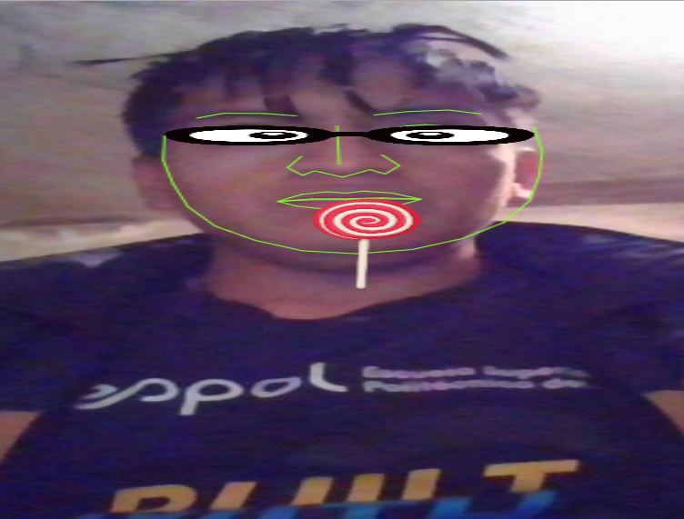

# Web Face JavaScript in Real Time

### Javascript library for precise tracking of facial features via Constrained Local Models
[LibraryUsed](https://github.com/auduno/clmtrackr)

#### Face Points Used

#### View

